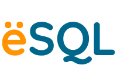

## 

&emsp; <b>e-SQL</b> Adalah Media Pembelajaran Basis Data Berbasis Website, e-SQL Menyediakan Materi Pembelajaran Basis Data Khsususnya <i>Structured Query Language</i> (SQL) Yang Rangkum Sehingga Mudah Untuk Dipahami, Selain Materi SQL, Media Pembelajaran e-SQL Juga Mengadaptasi Fitur <i>Live Coding</i> Sehingga Pengguna Dapat Mempraktekan & Melatih Pengetahuan Yang Diperoleh Melalui Media Pembelajaran Secara Langsung. 

 
&emsp; Media Pembelajaran e-SQL Dikembangan Dengan Menggunakan <a href="https://nextjs.org/">Next.js</a> & Dikemas Dengan Tampilan Antarmuka Yang Dibangun Menggunakan <a href="https://tailwindcss.com/">TailwindCSS</a> Yang Modern Serta Menarik, Namun Tetap Ramah Pengguna. Dengan Adanya Media Pembelajaran e-SQL Diharapkan Siapapun Dapat Belajar SQL Secara Gratis, Dimanapun & Kapanpun.

